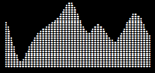
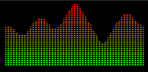
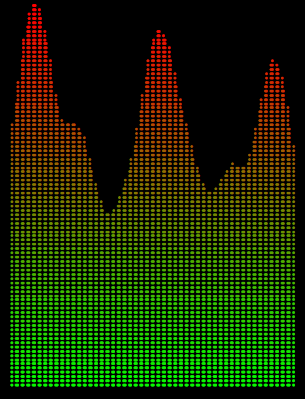
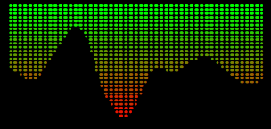
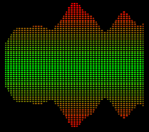

# Простой генератор графиков из шрифта Брайля

## Примеры применения
```tsx
<BrailleChart values={values} height={10} />
```    
### Чёрно-белый график  
    

---

```tsx
<BrailleChart values={values} height={10} colormatic={true} />
```  
### Цветной график  
    

---

```tsx
<BrailleChart values={values} height={30} colormatic={true} />
```  
### Изменение высоты графика (в символах)  
    

---

```tsx
<BrailleChart values={values} height={10} colormatic={true} reversed={true} />
```  

### Перевёрнутый график  
   

---

```tsx
<BrailleChart values={values} height={10} colormatic={true} reversed={false} />
<BrailleChart values={values} height={10} colormatic={true} reversed={true} />
```  
### Комбинированное использование  
     

---
**by AndcoolSystems, August 22, 2024**